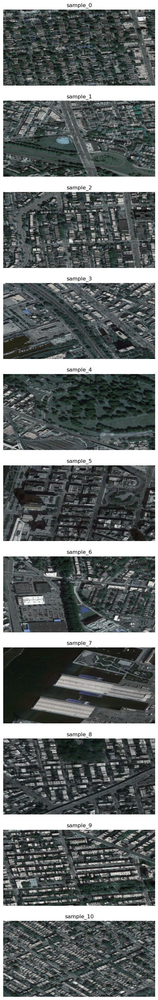
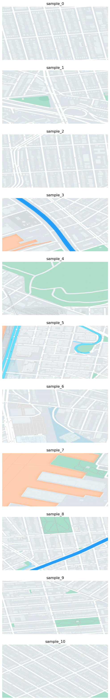
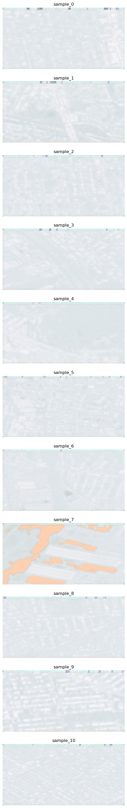

# GenerativeAdversarialNetwork
A quick implementation of GAN on google satellite calque dataset available at: http://efrosgans.eecs.berkeley.edu/pix2pix/datasets/maps.tar.gz

- the GAN code is in Generative_Models_test.ipynb

### Some nice result I got:

<table>
  <tr>
    <td align="center">
      <figure>
        
        <figcaption>satellite</figcaption>
      </figure>
    </td>
    <td align="center">
      <figure>
        
        <figcaption>label</figcaption>
      </figure>
    </td>
    <td align="center">
      <figure>
        
        <figcaption>prediction</figcaption>
      </figure>
    </td>
  </tr>
</table>